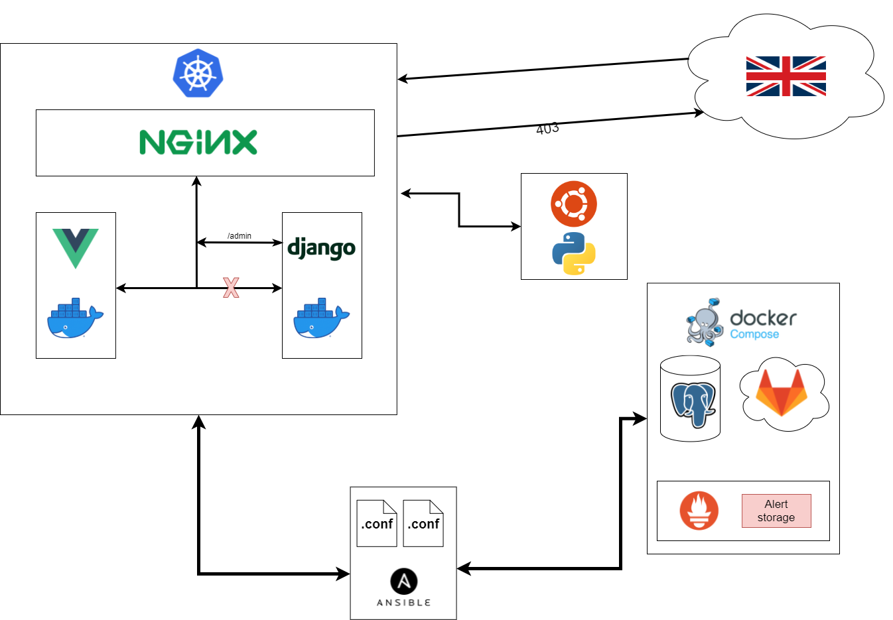

# دوره کار آموزی SRE 

## 

پیشنیاز ها :

* آشنایی با سیستم عامل لینوکس و مفاهیم شبکه
* آشنایی با مفاهیم پایه برنامه نویسی وب
* آشنایی با یک زبان برنامه نویسی (ترجیها python,bash )
* من وققتی این درو شروع کردم چند سالی فقط تجربه کار تو زمینه وب (django - flask ,react) و کمی هم تجربه مار با رزپری پای داشتم و دانش کافی در لینوکس و شبکه نداشتم و فقط بلد بودم باهاشون کار کنم 

# 

قدم اول :

سعی کنید یک ماشین مجازی داشته باشید و چند مدل لینوکس روش تست کنید و فایل های ماشین مجازیتون کپی بگیرید اول کار ممکنه چند بار کل سیستم عامل نابود کنید و وقتی کپی از ماشین مجازیتون داشته باشید برگزدوندن زمان کمتری می گیره تا نصب از اول من خیلی با سیستم عامل ubuntu راحت بودم و برای اول کار به نظر گزینه خوبیه چون هم راحته هم مشکلاتتون به خاطر جامعه بزرگش راحت تر می تونید حل کنید 

# 

آشنایی بیشتر با لینوکس :

شناخت پایه های لینوکس مثل فایل سیستم ، systemd , دسترسی ها و … که برای این کار خودم با کتاب <a href="https://www.amazon.com/dp/B089Y5P85X?language=en_US&ref=KC_GS_GB_US">Linux Bible 10th Edition</a> خواندم خیلی جامع هست و سر نخ هایی میده بهتون ه باهاش می تونید کلی چیز دیگه یاد بگیرید و خیلی مضوع های دیگه مثل امنیت و یک سری تسک های که تو دنیایی واقعی باهاش بر می خورید مثل ران کردن ftp سرور و کنار اون با مفاهیم مثل مانیتورینگ یا اتوماسیون هم آشنا میشید همچنین با اسکریپت نویسی و یکمم شبکه و بخشی از ابزاری که تو شبکه به کارتون میاد ابزاری که باهاش آشنا میشد دست کم نگیرید تو دنیا واقعی خیلی به کارتون میاد مثل vim , telnet ,systemctl  کار کردن با این ابزار و چیز های دیگه مثل regex و awk رو هم تمرین کنید باعث میشه خیلی سرعن کارتون بره بالا و کیفیت کارتون خیلی زیاد می کنه هرچیزی که تو ادامه این متلب راجبش می خواهیم صحبت کنیم داخل این کتاب یا به طور مفصل یا خلاصه راجبش صحبت شده 

# 

آشنایی بیشتر با شبکه :

توی کتابی که اول معریفی کردم(Linux Bible ) ایکم راجب شبکه صحبت کرده ولی می توید برای عمق بشتر برید سراغ network + شاید به چشمتون نیاد ولی دانش شبکه تو دیباگ کردن خیلی چیزه و ساختن زیر ساخت ها خیلی به کارتون میاد جوری که اصلا به فکرشم نمیکونید من برای یاد گیری سعی می کردم هر چیزیو با مثال یاد  بگیرم برای شبکه به کمک منتورم سعی کردم یک ip tunel بیارم بالا بین چنتا ماشین و سعی کنم مانیتور کنم پکت های که بین این ماشین ها رد بدل میشه ان کارو اول با  iftop کردم بعد سعی کردم با وایرشارک این کارو کنم چون اون ابزار بیشتری در اختیارتون می زاره 

# 

آشنایی با وب سرور و مفایهمش : 

برای این کار من خودم nginx پیشنهاد می دم باری یاد گیریشم یکمنبع خیلی خوب خود سایت nginx داره و یک کتاب رایگان هست <a href="https://www.nginx.com/resources/library/complete-nginx-cookbook/?utm_medium=cpc&utm_source=google&utm_campaign=amer-nx_mad&utm_content=eb-textad-retarget-cnvrt&_bt=491303871243&_bk=%2Bnginx%20%2Bbook&_bm=b&_bn=g&_bg=99541599046&gclid=CjwKCAjw64eJBhAGEiwABr9o2NF7twUaTwYDPnGpzD63vG7gg73qDKEBQk3Mt0fbwprefyKwchNKOhoCH1QQAvD_BwE">the complete nginx cookbook</a> پروژه ای که برای این کار انجام دادم خیلی ساده بود یک وب اپپ پایتونی سعی کردم باهاش بیارم بالا و چیز هایی مثل ریورس پروکسی ، یا سرور کردت فایل های استاتیک انجام دادم و یم پروژه دیگه که خیلی خیلی بهم حال داد این بود که با استفاده از زبان lua یک اسکریپتی نوشتم که بیاد از دیتا بیس redis چک کنه ببینه ip که ریکوست زده اجازه عبور کدن از nginx داره یا نه برای این کار من از open resty استفاده کردم 

# 

آشنایی و کار با دیتا بیس : 

داخل کتابی که معریفی کردم کمی راجب دیتا بیشس و یکیمی راجبع دستوراتش بهتون توضیح داده معمولا از شما توقع میره دیتا بیس هارو بتونید هندل کنید خودم فکر می کردم کار با دیتا بیس بلدم اما وفتی توقع هایی که ازم می رفت دیدم فهمیدم خیلی موضوع عمیق تر از این حرف هاس و بعضی وقت ها با دییتا بیس کار کردن استرس زاس و پر مسعولیت برخورد اول تو محیط ارم این بود که ساعت 1 شب باید دیتا بیس مستر رو dump می کردم رو slave اگر با این استلاحات آشناا نداریند نگران نباشید خودمم خیلی هنوزم باهاشون آشنا نیستم برای شروع من دوره <a href="https://www.youtube.com/watch?v=ER8oKX5myE0">youtube</a> پیشنهاد می دم هرچند زمان کار آموزیم این ویدیو رو ندیده بودم ولی به نظرم برای شروع دوره خوبی هست برای mysql بهتره با redis هم کمی تجربه کار داشته باشید 

# 

آشنایی با اسکریپت و برنامه نویسی :

من به شخصا چون بک گراند برنامه نویسی داشتم برای زیاد سخت نبود داخل این زمینه زبان هایی که خیلی کاربرد دارن پایتون هست و bash  ولی زبانی مثل گو و سی / سی ++ هم پر طرفدار هست برنامه نوسی بهتری عمیق تر یاد بگیرید برای شروع من پایتون پیشنهاد می دم چون ساده هست و یک جامعه بزرگ پشتش هست تا ایراداتونو قبل شما بهش برخورده باشه حل کرده و منتشر کرده راه حلشو قدرت حل مسیله ، شناخت ابزار مهم ترین بخش تو این زمینس به نظر من می تونید برای python از سایت هایی مثل <a href="https://www.hackerrank.com/">hackerrank</a> استفاده کنید اگر هم تجربه ندارید برای  بش هم من این فیلم از <a href="https://www.youtube.com/watch?v=2PGnYjbYuUo">youtube </a>استفاده کنید و فیلم هایی آموزش پایتون هم داخل این کانال هست سعی کنید بیشتر مسائلی حل کنید که روی متن یک پردازشی انجام میده چون داخل دنیایی واقعی از این مسایل زیاد بر می خورید 

# 

آشنای با docker :

جای راحت کار من اینجا بود چون کلی منابع بود و خیلی هم پیچیدگی نداشت اولش هرچند خیلی مفهوم پیچیده ای نداره ولی کلی امکانت ابزار داره سعی کنید این مورد رو حتما پورژ] ای برید جولو مثل اینکه ما یک سایتی می خوایم داشته باشید که یک دیتا بیس داره یک بک اند و یک فرانت حالا اینو با داکر بیاردی بالا تا با مفهوم هایی مثل اینوایرمنت ها بیس ایمیج ها مولتی استیجینگ والیوم و کلی چیز دیگه آشنا شید من خودم با 3 تا کتاب تغریبا حجیم ایم موصوع رفتم جلو ولی فقط با یک دونش خیلی ارتباط برقرارر کردم و فقط همونو تموم کردم که کتاب docke in practice بود کنار اون بعضی جاها که گیر می کردم سراغ کتاب docker in action  و Docker Deep Dive بود برای این کار هم یک پروژه داشتم که قرار بود یک ورد پرس رو روی docker swarm بیارم بالا در حالتی که ورد پرس روی یک node و mysql روی یک نود دیگه روی 2 تا ماشین جدا باشن شما بادید کار با داکر و داکر کامپوز خوب یاد بگیرید ولی داکر سورم لزومی نداره ولی سعی کنید یک آشنایی داشته باشید 

# 

آشنایی با مانیتورینگ :

برای مانیتورینگ داخل کتاب Linux Bible از ابزاری به اسم cocpit استفاده کرده من خودم خیلی باهاش آشنایی ندارم و تو ایم مدت کوتاهی هم که دارم داخل این زمینه کار کردم جایی نشنیدم و ندیدم که با این ابزار کار کنه و ممکنه بخشی از نیاز هارو تو این زمینه کاری برطرف نکنه بیشتر از ابزاری promethus و مکنمل اون grafana استفاده میشه معمولا حالا اصلا چرا باید همچین ابزاری استفاده کنیم  خوب راستش شما از خیلی از اتفاقات وقتی از ابزار مانیتورنگ و آلرت منیجر ها استفاده می کنید جلول گیری می کنید یک تجربه شخصی بخام بهتون بگم اینه شما خیلی واضیح می تونید پر شدن هارد سرور هارو ببینی و از کرش کردن سرور ها جلوگیری کنید داکیومت رسمی promethus تغریبا نیازتون بر طرف می کنه و با گوگل کردن خیلی راحت می تونید نیاز هاتونو رفع کنید برای شروه ویدیو های کانال یوتیوب <a href="https://www.youtube.com/channel/UCdngmbVKX1Tgre699-XLlUA">TechWorld with Nana</a> پیشنهاد می دم برای مانیتور کردن از دستورات لینوکسی هم مثل htop می تونید استفاده کنید وقتی رو یک سرور کار می کنید و نشونه های خوبی از خرابی های احتمالی و یا سلامت سرور میده بهتون 

# 

آشنایی با لاگینگ (ابزاری برای خواندن لاگ ها ) : 

مهمترین ابزار اینجا elastic search هست دنیایی خیلی خیلی گسترده ای هست و یکی ار کاربرداش فقط لاگینگ هست ولی باید یکم عمیق تر این بحث یاد بگیرید چون مهمترین بخش برای دیباگ کردن دیباگ کردن داکر یا سرویس ها یا هرچیز دیگه ای اولین قدمش خوندن لاگ هاشه برای لاگگینگ من اولین کاری که کردم داخل دوره کار آموزیم اینبود که یک اپپ پایتونی نوشتم که لاگ های nginx بخوانه و بفرسته به یک اند پونتی تا بتونم راحت با یک ریکوست لاگ هارو دریافت کنم برای ابزاری که الان خیلی استفاده میشه برای این کار معمولا elk  یا Elasticsearch, Logstash, Kibana   و efk یا Elasticsearch, fluentd, Kibana هست شما به الستیک سرچ به چشم یک دیتا بیس نگاه کنید قراره لاگ هارو داخل اون بریزیم به روش های مخطلف که از خواندن روی سرور خودش باشه تا فرستارن به وسیله ابزاری مثل filebet باشه اما خیلی عمیق تره و کلی کار برد دیگه داره و خود منو یک جایی گیر انداخت به خواطر ندونستن مبانیش و اصولش بخش بعدی که باهاش کار داریم یک ابزاری هست که بتونیم لاگ هارو مرتب کنیم که fluentd یا logstash استفاده می کنیم این ابزار شما خیلی ساده می تویند بهشون بگید که هر لاگ تو چه دسته بندی بزاره یا کجا لاگ رو نیاز داریم ولی سعی کنید قبل استفاده از این ابزار خودتون یک ابزار شبیه اینا تولید کنید تا خودتونو محک بزنید 

# 

آشنایی با kubernetest :

کوبرنیتیست خیل خیلی دنیا بزرگی که واقعا باید برای زمان بزارید و بخش خیلی خیلی بزرگیش تو کار یاد می گیرید و داخل هر ورژنش کلی فیچر جدید اضافه می کنه و واقعا جذاب و سخته من برای شروع با ویدیو ها کانال <a href="https://www.youtube.com/channel/UCdngmbVKX1Tgre699-XLlUA">TechWorld with Nana</a> شروع کردم و بعد کتاب The Complete Kubernetes Guide سایت و کانال های یوتیوب ردهت و ibm و گوگل خیلی خیلی مفیدن و کتاب Kubernetes  Up & Running خیلی کمکتون می کنه دریایی خیلی بزرگی ازش نترسید اگر خیلی زمان می بره یادگیرینش 

# 

خورده ریز هایی که بهتره باهاشون کمی :

کار کردن و آشنایی با ابزاری مثل rabbit Mq , apache kafka , MinIO , ceph بهتره داشته باشید 

# 

این اولین پروژه بزرگی که تو دوره انجام دادم 

 تو این پروژه برای اینکه من توی جنگو عمق تر بودم با جنگو یا هر ابزار دیگه یک وب اپ نوشتم و فرانشو وصل کردم به یک vue و بعد فقط آدرس ادمین جنگو از بیرون قابل دیدن بود غیر این صورت 403 می داد و همه آدرس های ویو اما از بیرون میشد دید همه اینها داکرایز شدن و روی کوبر نیتیست اومدن بالا دیتا بیس پوستگرس ، گیت لب و پرومتیوس و گرافانه با داکر کامپوز اومدن بالا و از همه جا دیده می شدن بخش کانفیگ های و ابزار مورد نیاز با یک فایل انسیبل انجام شد و با گرافانا یک آلرت برای استورج ست شده بود برای انجین ایکس هم مثل پروژه بالا ip لیست انگلیس رو ( چو می تونستم تست کنم شما هر رنج آی پی که می تونید تست کنید این کارو کنید ) بستم و 403 بر می گردوند یک اسکریپت پایتونی هم نوشتم که به صورت رندوم به اندپونت ها ریکوست بزنه برای کد هم یک ci با گیت لب راه انداختم  توی این پروژه گیت لب و انسیبل برام جدید بود که این سری ویدیو های آموزشی من براش پیشنهاد می دم <a href="https://www.youtube.com/watch?v=34u4wbeEYEo&list=PLaFCDlD-mVOlnL0f9rl3jyOHNdHU--vlJ">gitlab </a>, <a href="https://www.youtube.com/watch?v=3RiVKs8GHYQ&list=PLT98CRl2KxKEUHie1m24-wkyHpEsa4Y70">ansible </a>

# 

پروژه نهایی:

پروژه نهایی که من همراه با یکی از دوستام انجام دادم چند بخش بود اولیش و پر چالش ترینش نوشتن یک اپراتور برای کوبر نیتیست بود که برای نصب یک دیتا بیس بود که شما نوع دیتا بیس رو بهش می دادید که مانگو باشه یا mysql و بعد اون همه کار ها مثل ساخت پاد و سرویس و پی وی سی انجام می داد علاوه بر اون یک  cli  برای دیتا بیس هم می آورد بالا این کار رو با استفاده از لایبری پایتونی <a href="https://kopf.readthedocs.io/en/stable/">kopf </a> 

پروژه بعدی ما بک آپ گریفتن از etcd که یک جور دیتا بیس شما در نظر بگیرید که کانفیگ های کوبر نیتیست و همه اطلاهاتشو نگه می داره به صورت منظم بود که ما این کارو با پایتون کردیم و یک کران جاب براش نوشتیم تا منظم این کار انجام شه 

یک کار عملیاتی دیگه هم داشتیم که بالا آوردن یم efk بود و فیلتر کردن یک سری از لاگ ها یک پروژه تحقیقاتی هم داشتیم راجب ceph بهترین روش استفاده از اون داخل سناریو های مولتی زون برای اینکه بدونید این سناریو چه حوری هندل می کنن ویدیو های این کانال ببنید تا هم با این سناریو و هم با  <a href="https://www.youtube.com/channel/UCV_OrwHDqXdz7JuxjROhetA">ceph </a>بیشتر آشنا شید 

# 

کلام آخر :

تو این زمینه کنار دونستن تکنولوژی ها دونستن رفتار کاری و آشنایی بیشتر با اینکه قراره زندگیتون چه جوری پیش بره تو این شغل خیلی مهمه و ممکنه اولش کمی شکه شید سعی کنید بیشتر تمرین کنید ممکنه تکنولوژی ها به سرعت تغیر کنن و باگ های امنتی توشون به وجوب بیاد برای همین موضوع سعی کنید حتما از اخبار روز این دنیا دور نمونید باید حتما حتما مهارت زبان انگلیستون قوی کنید به خصوصو در زمینه خوندن و نوشتن و بهتره این 3 <a href="https://sre.google/books/">کتاب </a>رو شزوع کنید خوندن که برای گوکل هست و توش کلی سناریو یاد می گیرید و چیز هایی رو که تو دنیا واقعی بهش بر می خورید حتی اینکه با تیمتون چه جوری رفتار کنید قبل ورود تو این زمینه باید با خودتون کنار بییاد که تو این زمینه آن کال بودن و وظیفه و مسولیتتون معمولا از بقیه تیم ها بیشتره و همچنین وسعت دانشتونم بیشتره کد نویستونو سعی کنید قوی کنید و کد تمیز بنویسید ولی وسواس نداشته باشید می تونید از کتاب های The Clean Coder , Clean Code,Clean Architecture از Robert Cecil Martin   استفاده کنید ولی یادتون باشه همیشه این قوانین درست کار نمیکنه ممکنه اگر بخواید روی کد های قدیمی تغیراتی بدید که از این قوانین استفاده کنه تبدیل شه به یک مشخل خیلی خیلی بزرگ وقتی وارد این زمینه میشید ممکنه یک خراب کاری هایی خیلی بزرگ کنید سعی کنید این خراب کاری ها چه بزرگ چه کچیک از تیمتون پنهان نکنید و نترسید 

